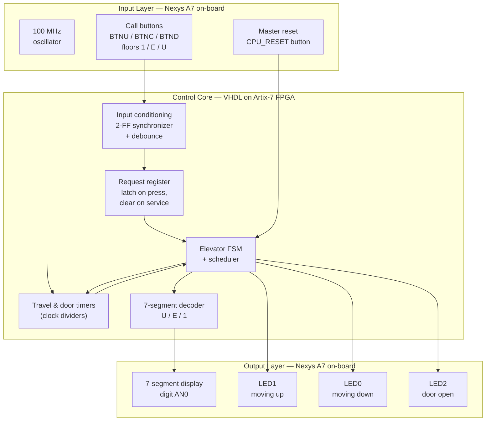
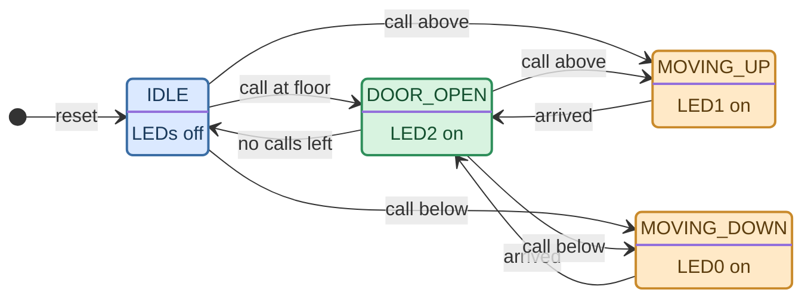
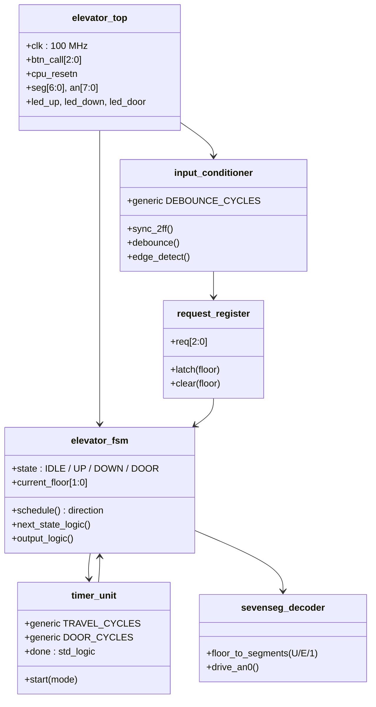
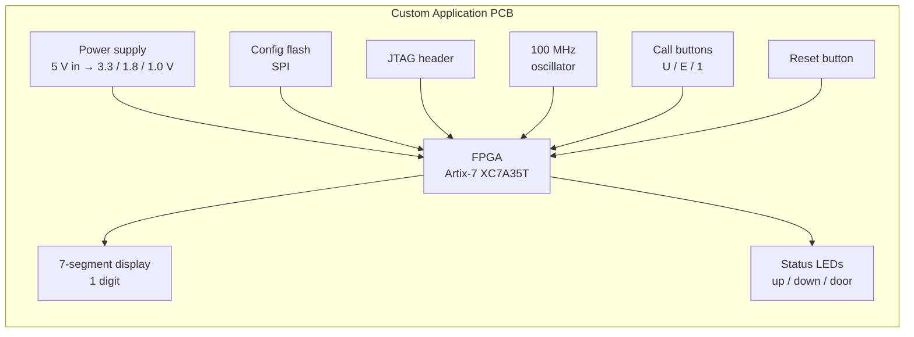

# Project Concept: 3-Floor Elevator Controller (MVP)
### A VHDL Finite State Machine on the Digilent Nexys A7-100T, with a Custom PCB Transition Path

**Course:** Hardware Engineering Lab (SS 2026)
**Professor:** Prof. Dr.-Ing. Ali Hayek
**Submission Date:** 11.06.2026

---

## Team Members (Team A6)
- Akter, Suchi
- Boiddo, Sumon
- Nnachi-Egwu, Nnaemeka
- Oyemade, Oluwasholape Daniel

---

## Introduction

Elevator controllers are a classic application of digital control: a small set of asynchronous user inputs must be arbitrated into a safe, deterministic sequence of actions. The decision core of every elevator is a Finite State Machine (FSM), which makes the problem an ideal candidate for an FPGA-based hardware design exercise.

This project implements a **3-floor elevator controller** in VHDL as a **Minimum Viable Product (MVP)**: one call button per floor, timer-modeled motion, and status indication via a 7-segment display and LEDs. The focus lies on clean synchronous design, explicit request arbitration, and correct handling of asynchronous, bouncy inputs.

Development follows a two-phase pipeline:

1. **Phase 1 — FPGA prototype:** simulation, synthesis, and live demonstration entirely on a **Digilent Nexys A7-100T** board. All required inputs and outputs (push buttons, LEDs, 7-segment display, 100 MHz clock) are available on-board — **no external hardware is used in this phase**.
2. **Phase 2 — Custom PCB:** a dedicated standalone board specification that carries the verified design from the multi-purpose development board to application-specific hardware.

The three floors follow German signage convention:

| Floor label | German | English | Internal index |
|:---:|---|---|:---:|
| **1** | 1. Obergeschoss | First floor | `10` |
| **E** | Erdgeschoss | Ground floor | `01` |
| **U** | Untergeschoss | Basement | `00` |

---

## Concept Description

### Target Application

The controller coordinates a single elevator cabin across three floors. Each floor has **one call button**; a press latches a request for that floor. A synchronous FSM arbitrates the pending requests with a starvation-free scheduling policy and drives the status outputs: the current floor character on a 7-segment display, two travel-direction LEDs, and a door-status LED.

### Block Diagram

### Board Resource Mapping (Nexys A7-100T)

The table below fixes the pin-level mapping used in the constraints file (`.xdc`):

| Function | On-board resource | Notes |
|---|---|---|
| Call button — floor **1** | Push button `BTNU` | Vertical button layout mirrors floor order |
| Call button — floor **E** | Push button `BTNC` | |
| Call button — floor **U** | Push button `BTND` | |
| Master reset | `CPU_RESET` button | Async assert, sync release (see FSM section) |
| Floor display | 7-segment digit `AN0` | Characters `U` / `E` / `1` |
| Direction up | `LED1` | |
| Direction down | `LED0` | |
| Door open | `LED2` | On only during `DOOR_OPEN` |
| System clock | 100 MHz oscillator `E3` | All logic synchronous to this clock |

---

## Control Logic and State Architecture

### Request Register

Button presses are momentary, but a request must persist until it is served. A 3-bit **request register** (one bit per floor) latches each conditioned button press. A floor's bit is cleared exactly once — when the cabin arrives at that floor and enters `DOOR_OPEN` — so a held or repeated press cannot re-trigger the same trip.

### State Diagram

The FSM intentionally has **no final state**: an elevator controller runs indefinitely, returning to `IDLE` whenever the request register is empty. The `[*]` marker denotes only the entry point after reset.

| State | Behavior |
|---|---|
| `IDLE` | Cabin stationary at a floor (U, E, or 1), doors closed, awaiting a latched request. All status LEDs off. |
| `MOVING_UP` | Entered when a pending request index is above the current floor index. The travel timer models per-floor transit time; the floor register increments on timer expiry. `LED1` asserted. |
| `MOVING_DOWN` | Mirror of `MOVING_UP` for descent. `LED0` asserted. |
| `DOOR_OPEN` | Cabin holds at the target floor for the door-timer window. `LED2` asserted, the served floor's request bit cleared. On expiry, the scheduler evaluates remaining requests. |

### Scheduling Policy (Direction Priority)

1. **Continue in the current travel direction** while any request remains in that direction (a request at *E* is served on the way during a *U → 1* trip).
2. Only when no requests remain ahead does the controller reverse direction or return to `IDLE`.
3. From `IDLE`, simultaneous requests above and below are resolved nearest-floor-first; an exact tie is broken toward **up**.

Every latched request is therefore served in bounded time.

### Reset Behavior

The master reset is **asynchronously asserted and synchronously released** to avoid recovery metastability. On reset the FSM enters `IDLE`, all request bits are cleared, and the floor register initializes to **U** — demonstrations begin with the (virtual) cabin in the basement.

---

## Project and Team Management

### Approach

The team follows a milestone-driven approach aligned with the course schedule. Weekly lab sessions serve as checkpoints; tasks and progress are tracked through this GitHub repository (issues and commit history document who did what).

### Milestones

| Date | Milestone |
|---|---|
| 11.06.2026 | Concept draft submission (this document) |
| Week of 15.06 | VHDL implementation of all modules; self-checking testbenches passing in simulation |
| Week of 22.06 | FPGA validation on the Nexys A7-100T; start of PCB schematic |
| Week of 29.06 | PCB layout, BOM, and manufacturing files; presentation preparation |
| 02.07.2026 | Final presentation |
| 09.07.2026 | Final documentation submission |

### Task Breakdown and Roles

| Team Member | Role | Responsibilities |
|---|---|---|
| | VHDL / FSM Lead | Elevator FSM, scheduler, request register, timer units |
| | Verification Lead | Self-checking testbenches, simulation of all test scenarios, waveform analysis |
| | FPGA Integration Lead | Top-level integration, constraints file, synthesis/implementation, on-board validation |
| | PCB Lead | Component selection, schematic, layout, BOM, Gerber files |

Documentation and the final presentation are shared responsibilities; each member documents their own work area, with cross-review by another team member.

---

## Technologies

### Hardware Platform

- **Digilent Nexys A7-100T:** Xilinx **Artix-7 XC7A100T** FPGA, 100 MHz oscillator, push buttons, LEDs, and an 8-digit 7-segment display — covering every MVP input and output with zero external components.
- **7-segment display:** common-anode, shared cathode bus. Only one character is shown, so a single digit (`AN0`) is held active — no multiplexing logic required in the MVP.

### Design and Verification Tools

- **VHDL (IEEE 1076):** RTL description of all modules; synchronous FSM design style.
- **Xilinx Vivado:** simulation (XSim), synthesis, implementation, bitstream generation, and on-target debugging (ILA if needed).
- **Self-checking testbenches:** stimulus replay of representative trip patterns with assertion-based result checking, complemented by waveform inspection.

### Timing Design

All timing derives from the 100 MHz board clock via enable-based counters (no derived or gated clocks):

| Timer | Default value | Purpose |
|---|---|---|
| Debounce window | 10 ms | Filters mechanical bounce after the 2-FF synchronizer |
| Travel timer | 2 s per floor | Models transit time between adjacent floors |
| Door timer | 3 s | Models passenger entry/exit window |

All three are VHDL **generics**, shortened by orders of magnitude in simulation so testbenches run in microseconds.

---

## Implementation

### Module Structure

### Phase 1: Simulation and FPGA Verification

Minimum test scenarios validated in simulation before programming the board:

| # | Scenario | Expected behavior |
|:---:|---|---|
| 1 | Reset, then call from floor **1** while cabin at **U** | `IDLE → MOVING_UP` (passing E without stopping) `→ DOOR_OPEN` at 1 |
| 2 | Call button for the current floor | Direct `IDLE → DOOR_OPEN`, no movement |
| 3 | Requests at **U** and **1** while cabin at **E** | Nearest-first arbitration; both served, neither starved |
| 4 | New same-direction request arrives mid-travel | Served on the way (direction priority) |
| 5 | Button held down continuously | Exactly one latched request; no re-trigger |
| 6 | Reset asserted during `MOVING_UP` | Immediate return to `IDLE` at U, request register cleared |
| 7 | Bouncy stimulus on all inputs | Debounce yields one clean request per press |

### Phase 2: Custom Application PCB

After FPGA verification, the design migrates to a dedicated standalone PCB.

**FPGA selection.** The board uses a smaller member of the same family as the prototype: an **Artix-7 XC7A35T** in a hand-routable package. The MVP occupies a tiny fraction of even that device, the VHDL sources and Vivado flow carry over unchanged within the family, and the smaller package significantly eases layout and reduces cost compared to reusing the XC7A100T.

**Board-level block diagram.** The custom board carries only the components this project actually needs:

The board comprises the following subsystems:

1. **Power rail infrastructure** — step-down regulators derive the FPGA supply rails (**3.3 V** I/O, **1.0 V** core, **1.8 V** auxiliary) from a single input, with power-up sequencing per the Artix-7 datasheet.
2. **Configuration and programming** — the FPGA is volatile, so a **SPI configuration flash** stores the bitstream and loads it automatically at power-up; a **JTAG header** provides programming and debug access during development.
3. **Clock and reset** — an on-board **100 MHz oscillator** drives all logic, matching the prototype; a reset push button with RC filtering feeds the design's asynchronous-assert / synchronous-release reset scheme.
4. **Decoupling and noise isolation** — decoupling capacitor arrays placed directly at the FPGA power pins (smallest values closest) to absorb switching noise and preserve supply integrity.
5. **Signal conditioning** — defined pull-up/pull-down resistors on every push-button input plus first-order RC filters as analog pre-debouncing, ahead of the digital debounce logic.
6. **Display and LED drive** — 7-segment display and indicator LEDs driven through current-limiting resistors sized within the FPGA I/O drive limits.

**Design workflow.** The schematic is split into multiple sheets by function (power supply, FPGA, configuration and clock, peripherals). Each sheet is reviewed by another team member, an Electrical Rule Check (ERC) is run before layout, and a Design Rule Check (DRC) is run before generating manufacturing outputs.

**PCB deliverables:** schematics, PCB layout, 3D model, BOM, and Gerber files.

---

## Out of Scope (MVP Boundaries)

Separate cabin/hall call interfaces, door obstruction sensors, overload detection, emergency stop and alarm, motor/actuator control (movement is timer-modeled), homing/reference runs, multi-cabin coordination, and destination dispatch optimization.

---

## Results

*To be completed after implementation. Will include simulation waveforms of the test scenarios, resource utilization and timing reports from Vivado, and photos/video of the live demonstration on the Nexys A7-100T.*

---

## Sources / References

- Digilent Nexys A7 Reference Manual — https://digilent.com/reference/programmable-logic/nexys-a7/reference-manual
- Xilinx 7 Series FPGAs Data Sheet (Artix-7) — AMD/Xilinx DS180 / DS181
- Xilinx 7 Series FPGAs Configuration User Guide — AMD/Xilinx UG470
- Xilinx Vivado Design Suite User Guide
- IEEE Std 1076 — VHDL Language Reference Manual
- Digilent Nexys A7 Master XDC Constraints File — https://github.com/Digilent/digilent-xdc
