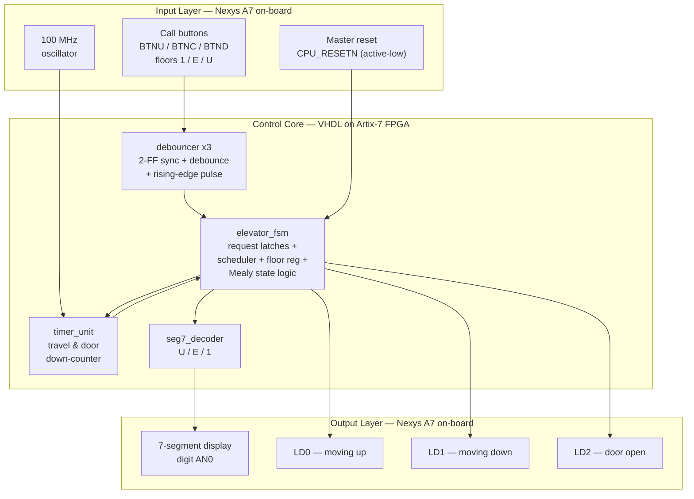
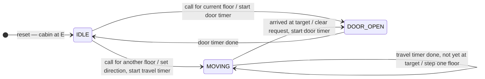
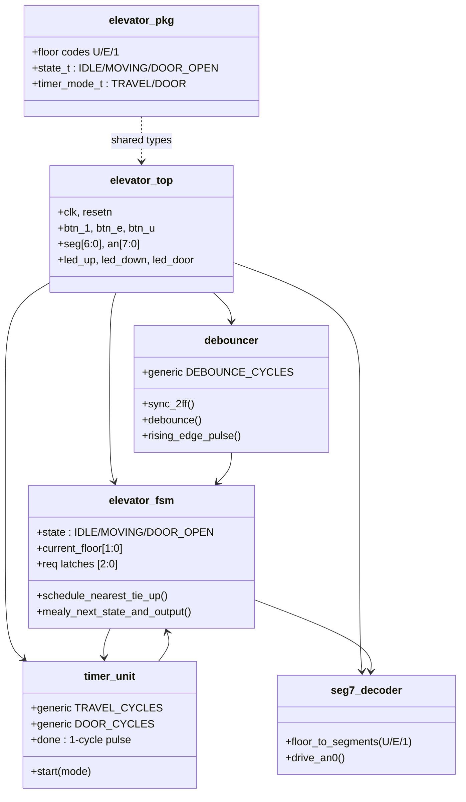
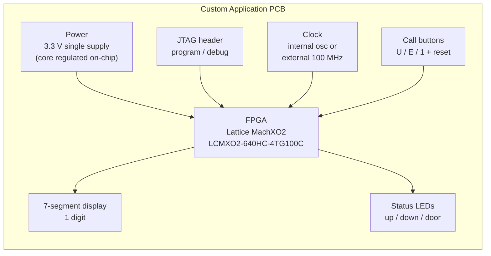

# Project Concept: 3-Floor Elevator Controller (MVP)
### A VHDL Finite State Machine on the Digilent Nexys A7-100T, with a Custom PCB Transition Path

**Course:** Hardware Engineering Lab (SS 2026)
**Professor:** Prof. Dr.-Ing. Ali Hayek
**Team:** A6
**Concept submitted:** 11.06.2026 · **Updated to as-built design:** 30.06.2026

---

## Team Members (Team A6)
- Akter, Suchi
- Boiddo, Sumon
- Nnachi-Egwu, Nnaemeka
- Oyemade, Oluwasholape Daniel

---

## Introduction

Elevator controllers are a classic application of digital control: a small set of asynchronous user inputs must be arbitrated into a safe, deterministic sequence of actions. The decision core of every elevator is a Finite State Machine (FSM), which makes the problem an ideal candidate for an FPGA-based hardware design exercise.

This project implements a **3-floor elevator controller** in VHDL as a **Minimum Viable Product (MVP)**: one call button per floor, timer-modeled motion, and status indication via a 7-segment display and LEDs. The control core is a **three-state Mealy FSM**. The focus lies on clean synchronous design, explicit request arbitration, and correct handling of asynchronous, bouncy inputs.

Development follows a two-phase pipeline:

1. **Phase 1 — FPGA prototype:** simulation, synthesis, and live demonstration entirely on a **Digilent Nexys A7-100T** board. All required inputs and outputs (push buttons, LEDs, 7-segment display, 100 MHz clock) are available on-board — **no external hardware is used in this phase**.
2. **Phase 2 — Custom PCB:** a dedicated standalone board built around a **Lattice MachXO2** FPGA, carrying the verified design from the multi-purpose development board to application-specific hardware.

The three floors follow German signage convention:

| Floor label | German | English | Internal code |
|:---:|---|---|:---:|
| **1** | 1. Obergeschoss | First floor | `10` |
| **E** | Erdgeschoss | Ground floor | `01` |
| **U** | Untergeschoss | Basement | `00` |

---

## Concept Description

### Target Application

The controller coordinates a single elevator cabin across three floors. Each floor has **one call button**; a press latches a request for that floor. A synchronous FSM arbitrates the pending requests with a nearest-first scheduling policy and drives the status outputs: the current floor character on a 7-segment display, two travel-direction LEDs, and a door-status LED.

### System Block Diagram



### Board Resource Mapping (Nexys A7-100T)

The table below fixes the pin-level mapping used in the constraints file (`elevator_constraints.xdc`):

| Function | On-board resource | Pin | Notes |
|---|---|---|---|
| Call button — floor **1** | `BTNU` | M18 | Active-high |
| Call button — floor **E** | `BTNC` | N17 | Active-high |
| Call button — floor **U** | `BTND` | P18 | Active-high |
| Master reset | `CPU_RESETN` | C12 | Active-low; inverted to active-high internal reset |
| Floor display | 7-segment digit `AN0` | — | Characters `U` / `E` / `1` |
| Direction up | `LD0` | H17 | |
| Direction down | `LD1` | K15 | |
| Door open | `LD2` | J13 | On only during `DOOR_OPEN` |
| System clock | 100 MHz oscillator | E3 | All logic synchronous to this clock |

---

## Control Logic and State Architecture

### Request Latching

Button presses are momentary, but a request must persist until it is served. Three **request latches** (one per floor), integrated inside the FSM, capture each debounced button pulse independently of the current state — so a press is never missed, even mid-travel. A floor's latch is cleared exactly once: when the cabin reaches that floor and enters `DOOR_OPEN`.

### State Diagram (Three-State Mealy FSM)



The machine is **Mealy**: outputs depend on state *and* input. The direction LEDs assert the same cycle a call resolves in `IDLE`, one cycle before the state register updates. This is also why a single `MOVING` state suffices — travel direction is an output computed from target-vs-current, not a separate state. The FSM has **no final state**; it returns to `IDLE` whenever no request is pending.

| State | Behavior |
|---|---|
| `IDLE` | Cabin stationary, doors closed, awaiting a latched request. All status LEDs off. |
| `MOVING` | Travelling toward the selected target. The travel timer paces per-floor transit; the floor register steps one floor on each expiry. Up or down LED asserted. |
| `DOOR_OPEN` | Cabin holds at the target floor for the door-timer window. Door LED asserted; the served floor's request latch cleared. On expiry, returns to `IDLE` and re-evaluates. |

### Scheduling Policy

The scheduler runs in `IDLE` and selects **one target per service cycle**:

1. Among pending requests, choose the floor **nearest** to the current floor.
2. On an exact distance tie, resolve **upward** (the higher floor is served first).
3. Serve that target, then return to `IDLE` and re-evaluate the remaining latches.

A request registered while the cabin is already moving is **not** picked up mid-travel; it is served on the following service cycle. Because every latched request is eventually selected and latches are never starved indefinitely (each cycle removes the nearest), all requests are served in bounded time. *(SCAN-style directional pickup — stopping at intermediate floors on the way — is a documented out-of-scope extension; see MVP boundaries.)*

### Reset Behavior

The design uses a **single synchronous reset**. The physical button is `CPU_RESETN` (active-low: released = 1 = run, pressed = 0 = reset); this is inverted once at the top level into an active-high internal reset distributed to all modules. On reset the FSM enters `IDLE`, all request latches clear, and the floor register initializes to **E** (ground floor) — demonstrations begin with the cabin at E. The design runs immediately on power-up; no button press is required to start.

---

## Implementation

### Module Structure

Six VHDL design units. The original concept's separate `input_conditioner` and `request_register` were consolidated — input conditioning into a reusable `debouncer` (instantiated three times), and request latching into the FSM — reducing inter-module signalling and reaching a verified system faster.



### Timing Design

All timing derives from the 100 MHz board clock via enable-based counters — no derived or gated clocks:

| Timer | Default value | Purpose |
|---|---|---|
| Debounce window | 10 ms | Filters mechanical bounce after the 2-FF synchronizer |
| Travel timer | 2 s per floor | Models transit time between adjacent floors |
| Door timer | 3 s | Models passenger entry/exit window |

All three are VHDL **generics**, shortened by orders of magnitude in simulation (the "N-test" technique) so testbenches run in microseconds while the synthesized hardware uses full-scale values — a single source serves both.

### Minimum Test Scenarios

| # | Scenario | Expected behavior |
|:---:|---|---|
| 1 | Reset | `IDLE`, display **E**, all LEDs off |
| 2 | At E, call floor **1** | Up LED, travel one floor, `DOOR_OPEN` at **1** |
| 3 | At 1, call **U** | Down LED, step through **E** to **U**, door at U |
| 4 | Call current floor | Direct `IDLE → DOOR_OPEN`, no movement, no direction LED |
| 5 | Bouncy press | Debounce yields exactly one request per press |
| 6 | At E, call **U** and **1** together | Tie resolved up: serve **1** first, then **U** |
| 7 | At U, call **1** | Up LED, display steps **U → E → 1**, single door at 1 |

---

## Phase 2: Custom Application PCB

After FPGA verification the design migrates to a dedicated standalone board, designed in **Altium Designer** and synthesized for Lattice silicon in **Lattice Diamond**.

**FPGA selection — Lattice MachXO2 `LCMXO2-640HC-4TG100C`.** A small, low-pin-count FPGA (640 LUTs, 100-pin TQFP, hand-solderable). The MVP occupies a tiny fraction of its resources, and the part choice deliberately simplifies the board versus reusing the Artix-7:

- **Single-supply power.** The `HC` device has an on-chip linear regulator and runs from one external **3.3 V** (or 2.5 V) supply, generating its core voltage internally — eliminating the multi-rail (3.3 / 1.8 / 1.0 V) supply and power-sequencing the Artix-7 would have required.
- **Instant-on, no external config memory.** MachXO2 is non-volatile with internal configuration flash, so the bitstream is stored on-chip and loads at power-up. No external SPI configuration flash is needed; a **JTAG header** provides programming and debug.
- **RTL portability.** The VHDL sources are vendor-neutral (no Xilinx primitives or IP), so they synthesize in Lattice Diamond unchanged.

**Board-level block diagram.**



**Subsystems:** single-rail 3.3 V power with decoupling capacitor arrays at the FPGA power pins; JTAG programming/debug header; clock (internal oscillator or external 100 MHz); pull-down resistors and first-order RC pre-filtering on every button input ahead of the digital debounce; current-limited 7-segment and LED drive within the device I/O limits.

**Workflow.** Schematic split by function (power, FPGA + config, clock/reset, peripherals), cross-reviewed, Electrical Rule Check before layout, Design Rule Check before manufacturing outputs.

**PCB deliverables:** schematics, PCB layout, 3D model, BOM, Gerber files.

---

## Out of Scope (MVP Boundaries)

SCAN-style directional pickup of intermediate calls, separate cabin/hall call interfaces, door obstruction sensors, overload detection, emergency stop/alarm, real motor/actuator control (movement is timer-modeled), homing runs, multi-cabin coordination, and destination dispatch optimization.

---

## Results

Phase 1 complete. All seven scenarios pass in self-checking simulation (XSim) and on hardware (Nexys A7-100T). Resource utilization is a small fraction of the XC7A100T with large positive timing slack at 100 MHz. See `report/` for the full verification table, Vivado utilization/timing screenshots, RTL schematic, and demonstration video.

---

## Project Management

### Timeline
| Date | Milestone | Status |
|---|---|---|
| 11.06 | Concept draft submitted | Done |
| Wk 15.06 | All VHDL modules + self-checking testbenches passing | Done |
| Wk 22.06 | FPGA validation on Nexys A7-100T | Done |
| Wk 29.06 | PCB design; documentation draft; presentation prep | In progress |
| 02.07 | Final presentation | Scheduled |
| 09.07 | Final documentation | Pending |

### Roles
| Member | Role | Contribution |
|---|---|---|
| Nnachi-Egwu, Nnaemeka | VHDL lead | Module RTL, FSM and scheduler, top-level integration, constraints, on-board bring-up |
| Boiddo, Sumon | Verification | Self-checking testbenches, simulation of all scenarios, results sign-off |
| Akter, Suchi | FPGA demo support | On-board demonstration, screenshots, demonstration video |
| Oyemade, Oluwasholape Daniel | PCB lead | Altium schematic, layout, BOM, Gerbers (MachXO2) |

Progress is tracked through the GitHub repository; the commit history is the authoritative record of individual contributions.

---

## Repository Structure

```
/src      VHDL design sources (6) + constraints
/tb       self-checking testbenches (5)
/report   technical report, screenshots, demo video, slides
/pcb      Altium project, schematic, layout, BOM, Gerbers (Phase 2)
```

---

## Sources / References

- Digilent Nexys A7 Reference Manual
- AMD/Xilinx 7 Series FPGAs Data Sheet (Artix-7), DS180 / DS181
- Lattice MachXO2 Family Data Sheet, FPGA-DS-02056
- AMD/Xilinx Vivado Design Suite User Guide; Lattice Diamond User Guide
- IEEE Std 1076 — VHDL Language Reference Manual
- Digilent Nexys A7 Master XDC Constraints File
