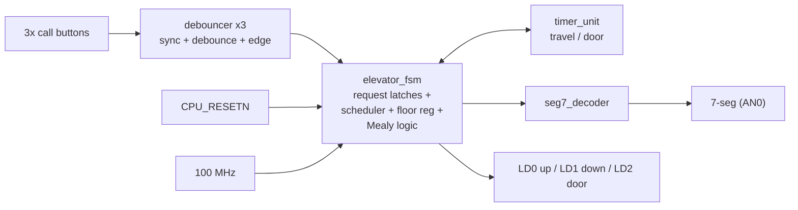

# Technical Report — 3-Floor Elevator Controller

**Course:** Hardware Engineering Lab (SS 2026) · **Team A6** · **Prof. Dr.-Ing. Ali Hayek**
**Target (Phase 1):** Digilent Nexys A7-100T (Artix-7 XC7A100T)
**Target (Phase 2):** Lattice MachXO2 `LCMXO2-640HC-4TG100C` custom PCB
**Date:** 30.06.2026

---

## 1. Abstract

A 3-floor elevator controller was designed in VHDL, verified by self-checking simulation, and demonstrated on a Digilent Nexys A7-100T FPGA board. The control core is a three-state Mealy finite state machine with integrated request latching, a nearest-first scheduler, and timer-modeled motion. All seven defined test scenarios pass in both simulation and hardware. A custom application PCB built around a Lattice MachXO2 FPGA carries the verified design to standalone hardware (Phase 2).

---

## 2. Objectives and Requirements

The controller serves a single cabin across three floors labelled by German convention — **U** (Untergeschoss / basement), **E** (Erdgeschoss / ground), **1** (1. Obergeschoss / first). Functional requirements:

- One call button per floor; a press registers a persistent request.
- Deterministic arbitration of pending requests with bounded service time.
- Timer-modeled travel (one floor at a time) and door dwell.
- Status output: current floor on a 7-segment display, travel-direction LEDs, door-open LED.
- Robust handling of asynchronous, mechanically bouncy button inputs.

Movement is modeled by timers rather than driving a physical motor — the MVP boundary agreed for this lab.

---

## 3. System Architecture

The design is partitioned into six VHDL units: a shared package, three instances of a reusable input debouncer, a timer, the FSM, a display decoder, and a structural top level.

Signal conventions used throughout: button edges, the timer `done` signal, and `timer_start` are all **single-cycle pulses**, which keeps the control handshake free of level-sensitivity bugs (a state cannot re-trigger on a held level).

---

## 4. Module Design

### 4.1 `elevator_pkg`
Shared declarations: the 2-bit floor codes (`U="00"`, `E="01"`, `1="10"`), the state type `(IDLE, MOVING, DOOR_OPEN)`, and the timer-mode type `(TMR_TRAVEL, TMR_DOOR)`. Centralizing these guarantees every module agrees on encodings.

### 4.2 `debouncer`
Conditions one raw button into one clean event in three stages: a **two-flip-flop synchronizer** removes metastability from the asynchronous input; a **debounce counter** accepts a new level only after it holds stable for `DEBOUNCE_CYCLES` (10 ms at 100 MHz); a **rising-edge detector** emits a single-cycle pulse per clean press. The debounce window is a generic, enabling fast simulation. Instantiated once per button.

### 4.3 `timer_unit`
A parameterized down-counter serving both travel (2 s) and door (3 s) intervals, selected by the `mode` input. A `start` pulse latches the target count and begins counting; `start` takes priority over an in-progress count, so the FSM can restart the timer cleanly on each floor step. Expiry produces a single-cycle `done` pulse. Both durations are generics (the N-test technique).

### 4.4 `elevator_fsm`
The control core. It holds the FSM state, the current-floor register, and three request latches.

- **Request latching** runs every cycle, independent of state, so a press is captured even mid-travel.
- **Scheduler (in IDLE):** scans the three latches, selects the floor nearest the current floor, and on a distance tie selects the higher floor (tie-goes-up). Floors are handled as integers internally so distance and stepping are simple arithmetic, converted back to the 2-bit code at the output.
- **Mealy outputs:** in `IDLE`, the direction LEDs and the move/open decision are computed from state plus the resolved request, asserting one cycle before the state register updates.
- **Motion:** in `MOVING`, each travel-timer `done` steps the floor register one position toward the target; on arrival the served latch clears and the machine enters `DOOR_OPEN`.
- **Reset:** synchronous; clears latches, sets state `IDLE`, initializes the floor register to **E**.

### 4.5 `seg7_decoder`
Pure combinational lookup mapping each floor code to the active-low segment pattern that renders `U`, `E`, or `1`, and driving a single digit (`AN0` active, others off). Because only one character is shown and held steady, no digit-multiplexing/refresh logic is required.

### 4.6 `elevator_top`
Structural integration: three debouncers, the FSM, the timer (wired to the FSM's `timer_start`/`timer_done` handshake), and the decoder. The active-low `CPU_RESETN` is inverted once here into the active-high internal reset. The hardware-scale generics (debounce 10 ms, travel 2 s, door 3 s) are exposed at the top so the system testbench can shrink them without editing RTL.

---

## 5. Key Design Decisions

| Decision | Choice | Rationale |
|---|---|---|
| FSM type | Mealy | Fewer states (one MOVING state, direction as output); reacts to a call in the same cycle. |
| State count | 3 (IDLE, MOVING, DOOR_OPEN) | Travel direction is an output, not a state — minimal, clear machine. |
| Scheduler | Nearest-first, tie-goes-up, one target per cycle | Simple, deterministic, starvation-free; matches MVP scope. |
| Reset | Single synchronous reset | All-synchronous design; no asynchronous recovery concerns. |
| Floor init | E (ground) | Natural demonstration start; board boots at E. |
| Request storage | Latches inside the FSM | Removes a module boundary and a class of cross-module bugs. |
| Display | Single static digit (AN0) | Only one character is ever shown — no refresh logic needed. |
| Timer scaling | Generics (N-test) | One source for fast simulation and full-scale hardware. |
| RTL portability | No vendor primitives/IP | Synthesizes unchanged in both Vivado and Lattice Diamond. |

---

## 6. Verification

### 6.1 Methodology
Each module has a dedicated self-checking testbench using VHDL `assert` with `severity error`; a PASS/FAIL note is printed per check, so results are read from the console rather than by inspecting waveforms. Testbenches use small generic values (the N-test technique) for fast runs. The FSM and system testbenches instantiate the already-verified `timer_unit`, making them true integration tests; the system testbench drives only the *raw* button and reset ports and checks behavior solely through the output ports (segment patterns, LEDs) — exactly what a board observer sees.

### 6.2 Module results
| Testbench | Checks | Result |
|---|---|---|
| `tb_timer_unit` | Travel and door intervals expire at exactly N cycles | PASS |
| `tb_debouncer` | Clean press → 1 pulse; bouncy press → 1 pulse; short glitch → 0 pulses | PASS |
| `tb_seg7_decoder` | U / E / 1 / blank patterns; AN0-only active | PASS |
| `tb_elevator_fsm` | Reset at E; tie U+1 served 1-then-U; multi-floor descent; single up-step | PASS |
| `tb_elevator_top` | End-to-end via raw I/O incl. one bouncy press | PASS |

### 6.3 System scenario results
| # | Scenario | Expected | Result |
|:---:|---|---|:---:|
| 1 | Reset | `IDLE`, display **E**, all LEDs off, AN0 active | PASS |
| 2 | At E, call **1** | Up LED, travel, `DOOR_OPEN` at **1** | PASS |
| 3 | Multi-floor descent | Down LED, step through **E** to **U** | PASS |
| 4 | Call current floor | Direct `DOOR_OPEN`, no movement, no direction LED | PASS |
| 5 | Bouncy press | Debounced to exactly one trip | PASS |
| 6 | Tie at E (U + 1) | Serve **1** first (tie-goes-up), then **U** | PASS |
| 7 | Full traverse | Display **U → E → 1**, single door at 1 | PASS |

---

## 7. FPGA Implementation (Nexys A7-100T)

Synthesis and implementation completed in Vivado; bitstream generated and programmed via the Hardware Manager.

- **RTL schematic** — see `rtl_schematic.png`: shows the six-module structure and the three debouncer instances.
- **Resource utilization** — see `utilization.png`: a few hundred LUTs/flip-flops, a small fraction of the XC7A100T. This headroom is the quantitative justification for selecting a far smaller FPGA for the PCB.
- **Timing** — see `timing_summary.png`: large positive Worst Negative Slack at the 100 MHz constraint; the logic is trivially within timing.

### Hardware demonstration
On programming, the board shows **E** with all LEDs off, confirming correct reset polarity (the design runs without pressing reset). The seven scenarios were exercised live and matched simulation. A demonstration video (`demo_video.mp4`) is included as presentation backup (Plan B).

---

## 8. Phase 2 — Custom PCB (in progress)

A standalone board is being designed in **Altium Designer** around the Lattice MachXO2 `LCMXO2-640HC-4TG100C` (640 LUTs, 100-pin TQFP). The part simplifies the board substantially versus the Artix-7:

- **Single 3.3 V supply** — the HC device regulates its core voltage on-chip, removing the multi-rail supply and power sequencing the Artix-7 would need.
- **Instant-on, internal config flash** — no external SPI configuration memory; a JTAG header handles programming and debug.
- **Unchanged RTL** — the vendor-neutral VHDL re-synthesizes in Lattice Diamond.

Remaining PCB work (owned by the PCB lead): schematic capture by functional sheet, ERC, layout and floorplanning, DRC, BOM, 3D model, and Gerber generation. Deliverables land in `/pcb`.

---

## 9. Project Management

### 9.1 Timeline
| Date | Milestone | Status |
|---|---|---|
| 11.06 | Concept draft submitted | Done |
| 15.06 | All VHDL modules + self-checking testbenches passing | Done |
| 22.06 | FPGA validation on Nexys A7-100T | Done |
| 29.06 | PCB design; documentation draft; presentation prep | In progress |
| 02.07 | Final presentation | Scheduled |
| 09.07 | Final documentation | Pending |

### 9.2 Roles and contributions

| Member | Role | Contribution |
|---|---|---|
| Nnachi-Egwu, Nnaemeka | VHDL / FSM lead | Module RTL, FSM and scheduler, top-level integration, constraints, on-board bring-up |
| Boiddo, Sumon | Verification | Self-checking testbenches, simulation of all scenarios, results sign-off |
| Akter, Suchi | Hardware demo support | On-board demonstration, screenshots, demonstration video |
| Oyemade, Oluwasholape Daniel | PCB lead | Altium schematic, layout, BOM, Gerbers (MachXO2) |

Workflow tracked through the GitHub repository; commit history is the authoritative record of individual contributions.

---

## 10. Conclusion

The 3-floor elevator controller meets all MVP requirements, verified in simulation and on hardware across seven scenarios. The three-state Mealy architecture kept the design minimal and defensible; generic-based timing gave fast verification with full-scale hardware behavior from one source; and the vendor-neutral RTL transfers directly to the MachXO2 PCB.

---

## 11. References

1. Digilent, *Nexys A7 Reference Manual*.
2. AMD/Xilinx, *7 Series FPGAs Data Sheet*, DS180/DS181.
3. Lattice Semiconductor, *MachXO2 Family Data Sheet*, FPGA-DS-02056.
4. AMD/Xilinx, *Vivado Design Suite User Guide*; Lattice, *Diamond User Guide*.
5. IEEE Std 1076, *VHDL Language Reference Manual*.
